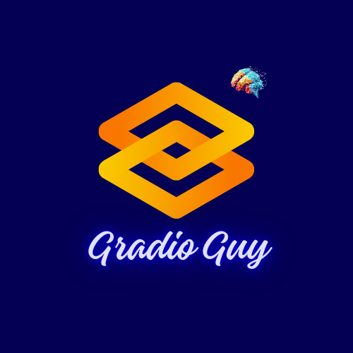

-----

## ⚡️ **Gradio Guy: Crafting AI Experiences with Code** ✨

  

-----

> **Building beyond the boilerplate.** I'm on a mission to push the boundaries of what's possible with **Gradio**, turning complex machine learning models into stunning, shareable web apps. Forget the old-school UI; this is about rapid prototyping and sleek design, all with Python.

-----

### **My Mission Control** 🛰️

I'm focused on three key areas to help you master Gradio:

  * **Code-first Creation:** Dive deep into **practical code examples** that showcase Gradio's power for everything from generative art to data visualization. I'll get you building, not just reading.
  * **Next-Gen Deployment:** Go from local machine to global audience. I'll guide you through the seamless process of deploying your Gradio apps on platforms like **Hugging Face Spaces** for instant sharing.
  * **Component Catalyst:** Unpack every component in the Gradio arsenal. From the foundational `gr.Interface` to the dynamic `gr.Blocks`, we'll explore how to leverage them to build bespoke, interactive UIs.

-----

### **Join the Journey** 🚀

  * **Stay Synced:** Follow me on social media to see the latest projects and tutorials.
  * **Contribute a Signal:** Got an idea for a Gradio project or a topic you want to see covered? Open an issue or start a discussion—I'm always ready to collaborate.

Let's build something epic. 👾
